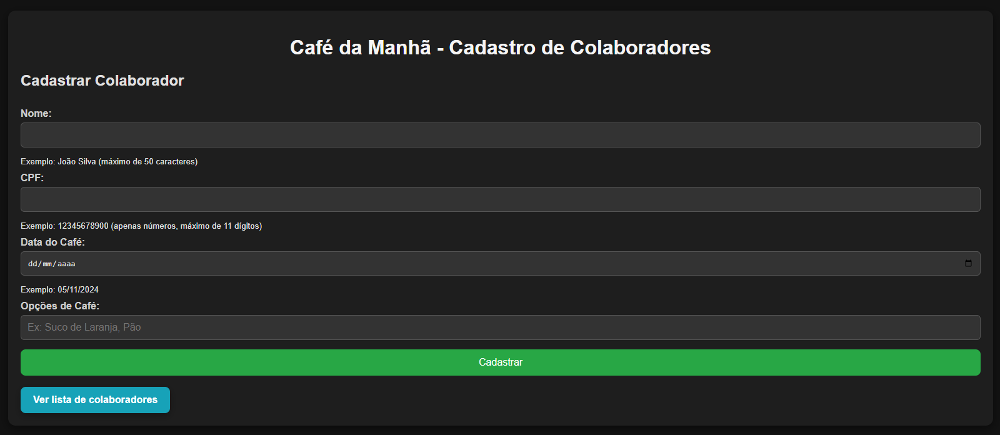
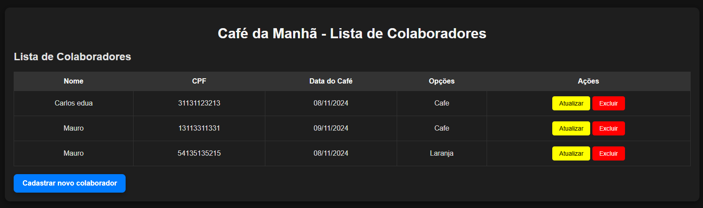
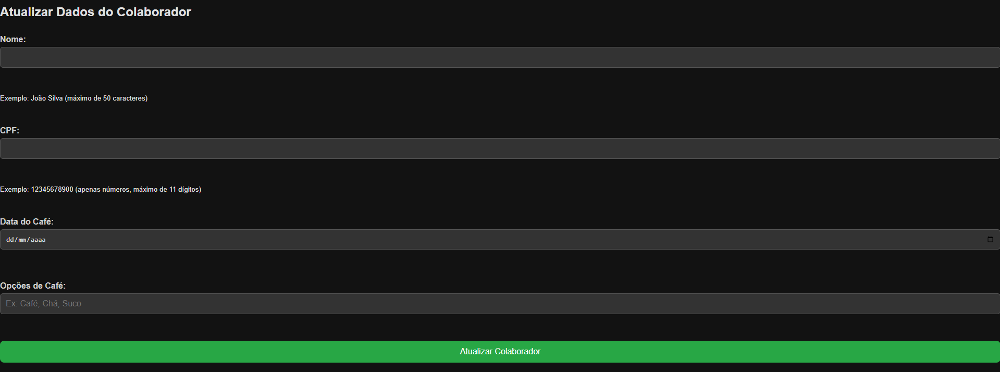

# Café da Manhã - Gestão de Participantes

Este projeto é uma aplicação web para organizar os participantes dos cafés da manhã da empresa. Os colaboradores podem informar o que vão trazer para o café da manhã, e é possível marcar se trouxeram os itens no dia do evento.

## Funcionalidades

- Cadastro de participante com nome, CPF, opções de alimentos/bebidas e data do café.
- Marcação automática dos itens como "não trazidos" após a data.
- Exibição da lista de participantes com o que planejam trazer.
- Validação para evitar:
  - Duplicação de CPFs e opções para a mesma data.
  - Data de café da manhã no passado.

## Tecnologias Utilizadas

- **Backend**: Java, Spring Boot, PostgreSQL, JPA

## Pré-requisitos

- **Java 17** ou superior

# Link do WEB Service: 
https://desafio-sulworktech-production-app.up.railway.app/index.html

